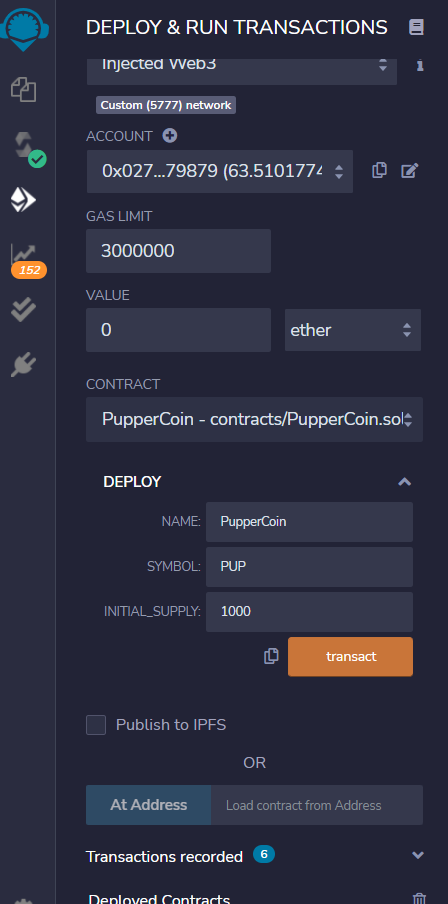
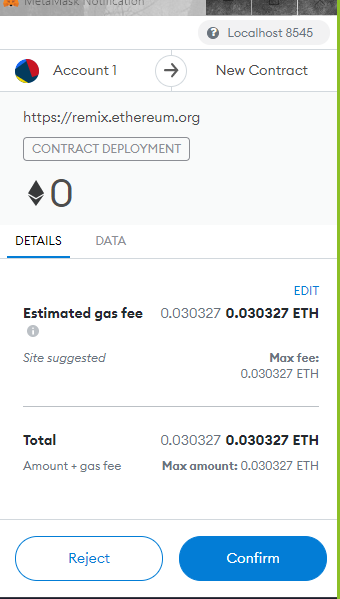

# ETH_Crowdsale

Using standardized implementations setting up a crowdsale with inted tokens. 

## Outline

Code implements and automates a crowdsale via PupperCoin tokens which will have initial minting capcit of 1000. It is set toraise 300 ETH for the entity running the crowd sale. 

## Implementation 

### Contract has following imports for implementing the PupperCoin.sol:

import "https://github.com/OpenZeppelin/openzeppelin-contracts/blob/release-v2.5.0/contracts/token/ERC20/ERC20.sol";

import "https://github.com/OpenZeppelin/openzeppelin-contracts/blob/release-v2.5.0/contracts/token/ERC20/ERC20Detailed.sol";

import "https://github.com/OpenZeppelin/openzeppelin-contracts/blob/release-v2.5.0/contracts/token/ERC20/ERC20Mintable.sol";

### Contract has the following importas for implementing CrowdSale.sol

import "./PupperCoin.sol";

import "https://github.com/OpenZeppelin/openzeppelin-contracts/blob/release-v2.5.0/contracts/crowdsale/Crowdsale.sol";

import "https://github.com/OpenZeppelin/openzeppelin-contracts/blob/release-v2.5.0/contracts/crowdsale/emission/MintedCrowdsale.sol";

import "https://github.com/OpenZeppelin/openzeppelin-contracts/blob/release-v2.5.0/contracts/crowdsale/validation/CappedCrowdsale.sol";

import "https://github.com/OpenZeppelin/openzeppelin-contracts/blob/release-v2.5.0/contracts/crowdsale/validation/TimedCrowdsale.sol";

import "https://github.com/OpenZeppelin/openzeppelin-contracts/blob/release-v2.5.0/contracts/crowdsale/distribution/RefundablePostDeliveryCrowdsale.sol";

## Process

We deployed PupperCoin contract - on Remix:

Deployed PupperCoin contract step - on MetaMask:

We minted PupperCoin as shown on the Remix:

3_PupperCoin_Minting_Remix

